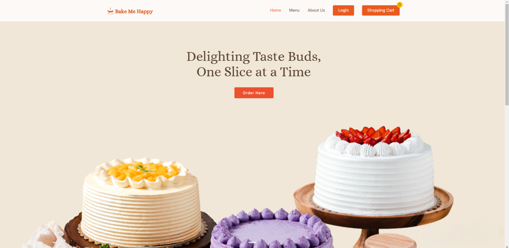
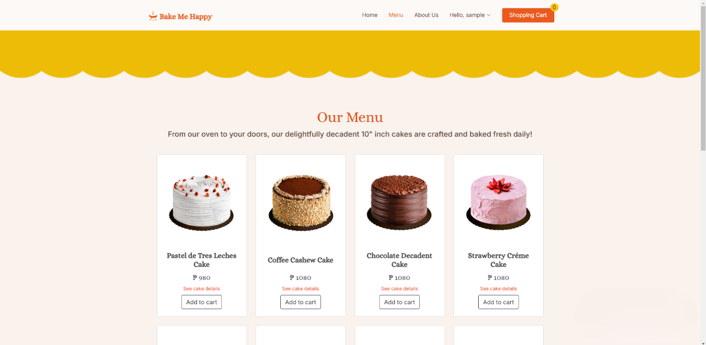
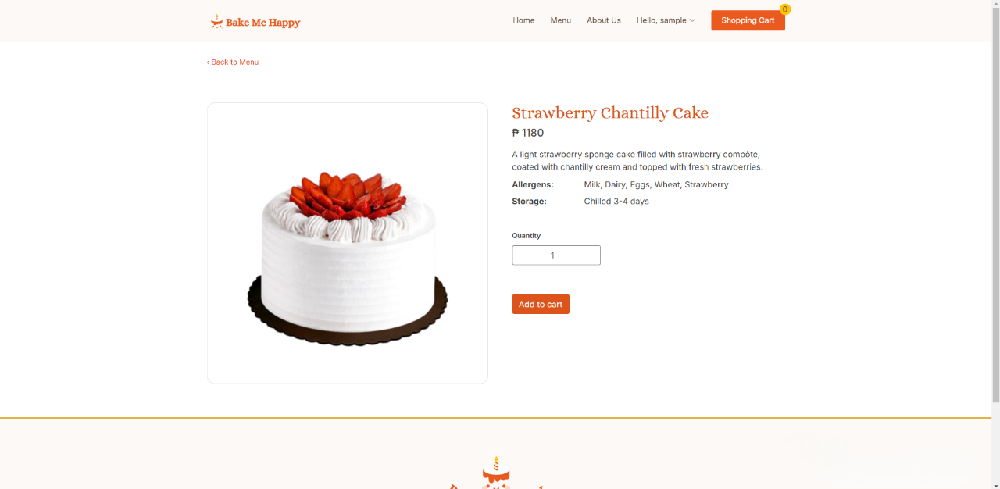
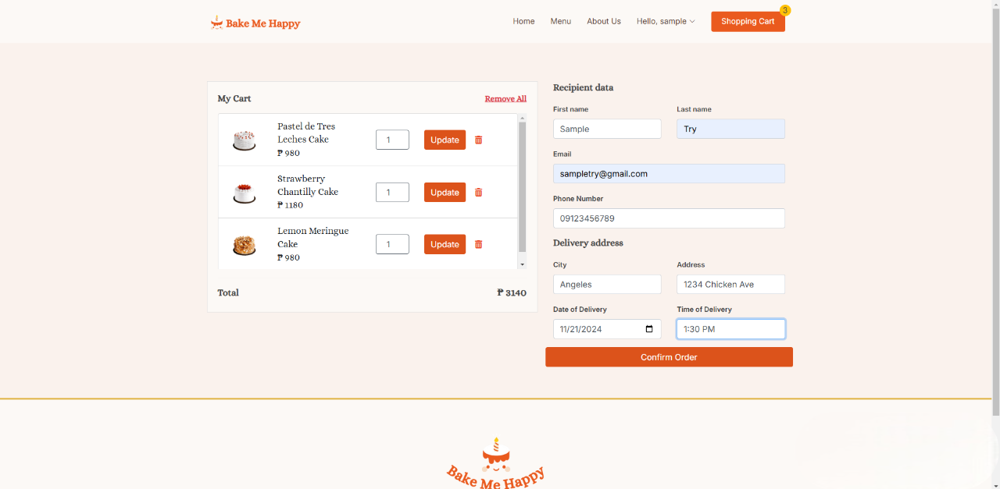
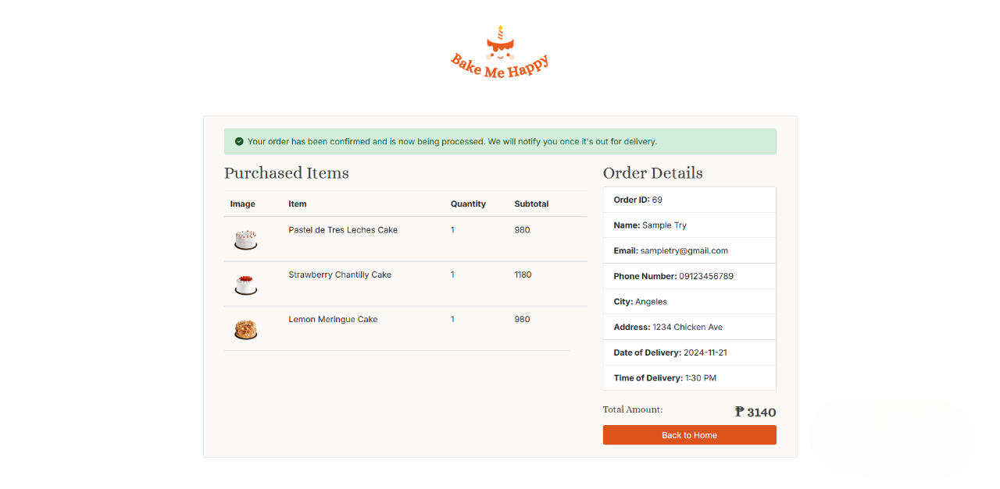

# Bake Me Happy
Bake Me Happy 🍰
Welcome to Bake Me Happy, the ultimate online destination for delicious, freshly baked cakes and pastries! Our e-commerce website makes it easy to browse our menu, customize your orders, and have your favorite treats delivered right to your doorstep. Whether you're celebrating a special occasion or just craving something sweet, we’ve got you covered.

## Table of Contents
- [Setup](#setup)
- [Screenshots](#screenshots)

## Setup
1. Make sure you have `MySQL` and a web server to run/interpret `PHP` in your system.
2. Clone or download the repo and put it to `xampp/htdocs/` if you're using windows, otherwise check tutorial(s) for your corresponding web server and OS. 
3. Create a database named `bakemehappy_db` and run the script `bakemehappy_db.sql` to create tables. Make sure your configuration matches with `config.php`, otherwise make the desired changes.
5. Run the app by `http://localhost/bake-me-happy-main/index.php`.
 
## Screenshots
**Customer**
- Cake Menu

- Cake Details

- Cart (with checkout form)

- Order summary

# bakemehappy
